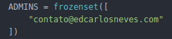
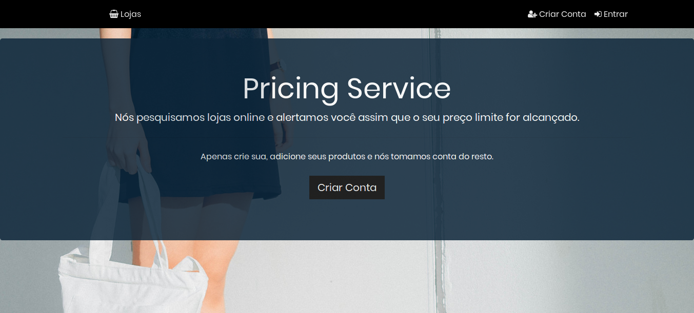
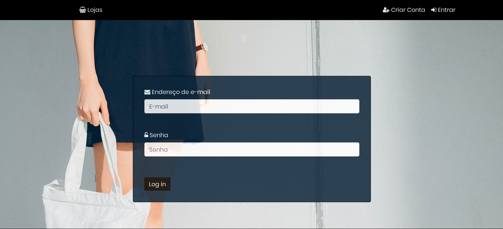
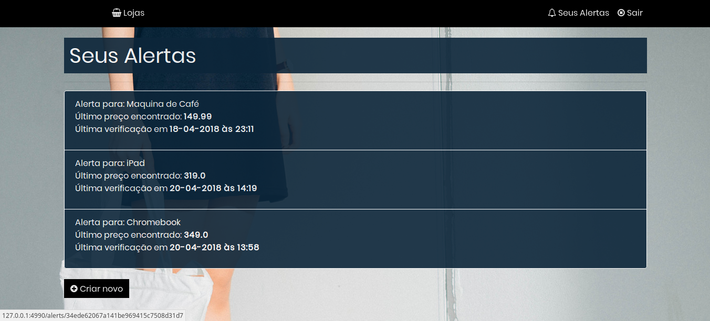
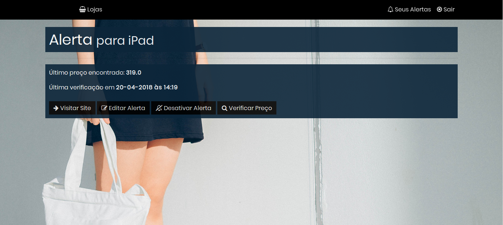
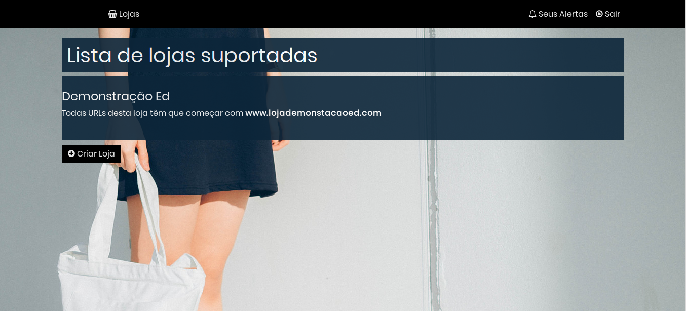
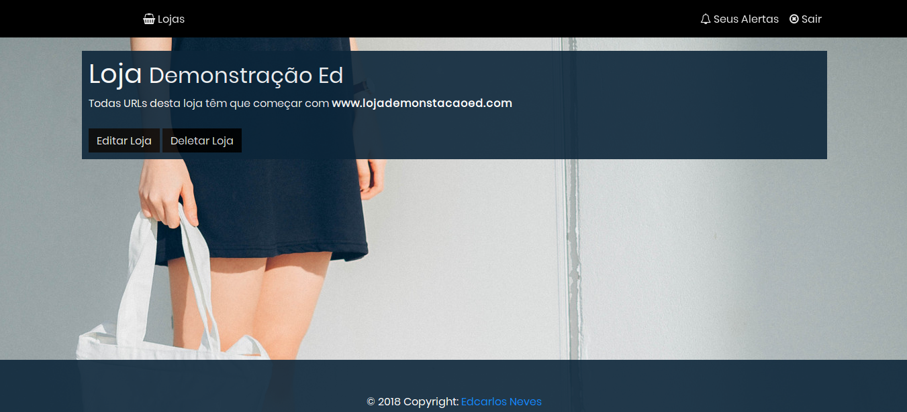

# Pesquisa Preços

Esta aplicação permite que sejam adicionados produtos de lojas diversas com um preço meta, onde o sistema fará uma verificação periódica do preço e quando este for igual ou menor ao preço meta setado pelo usuário, este receberá um email avisando.

Este projeto foi feito como parte do curso "The Complete Python Web Developer".

Os administradores do sistema podem adicionar, editar e remover lojas. Para isto, vá em 'src/config.py' e indique os administradores do sistema.

Foi utilizada uma conta no Mailgun para envio dos emails. **O sistema não funciona com lojas que injeta conteúdo dinâmicamente utilizando JavaScript**.

O sistema permite aos usuários: Fazerem registro, acessarem o sistema, criarem, editarem, apagarem alertas e verificarem preços manualmente. Os administradores podem criar, editar e excluírem lojas.

Tecnologias: MongoDB, Python (Flask, Jinja2), HTML/CSS/Bootstrap, Mailgun.

